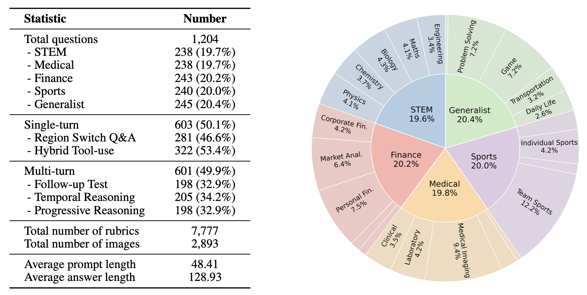
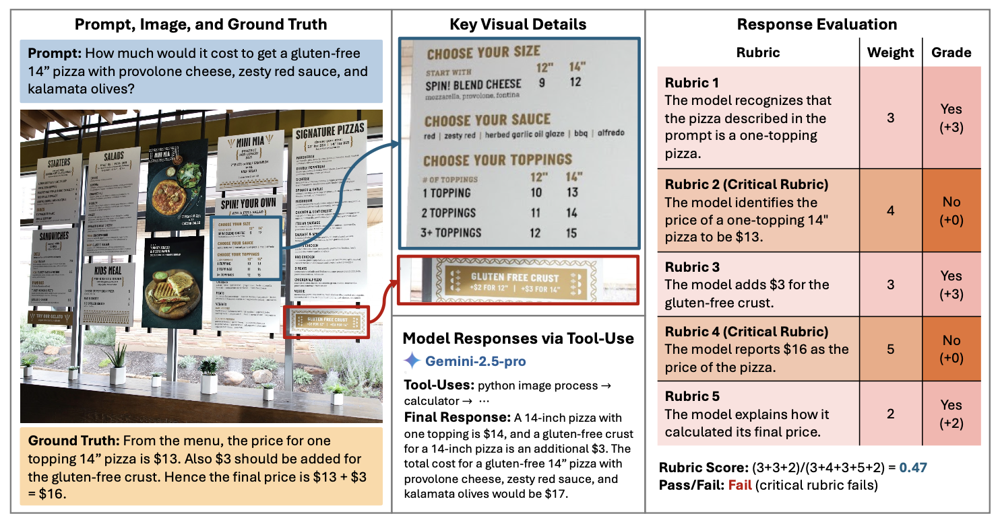

# VisualToolBench

<p align="left">
  <a href="https://huggingface.co/datasets/ScaleAI/VisualToolBench"></a>
  <a href="https://arxiv.org/abs/2510.12712"></a>
  
  
  
  
  
  
</p>

**VisualToolBench** is a comprehensive benchmark for evaluating vision-language models on **think-with-images** capabilities, tasks that require models to actively manipulate visual content, not just passively understand it.

## 📋 Table of Contents

- [Overview](#overview)
- [Dataset Sample](#dataset-sample)
- [Evaluation](#evaluation)
- [Installation](#installation)
- [Dataset](#dataset)
- [Configuration](#configuration)
- [Usage](#usage)
- [Supported Models](#supported-models)
- [Project Structure](#project-structure)
- [Citation](#citation)

## Overview

**VisualToolBench** is the first benchmark designed to evaluate vision-language models on **think-with-images** capabilities—the ability to actively manipulate and transform visual content to solve complex reasoning problems.

Unlike traditional VLM benchmarks that test passive image understanding, VisualToolBench challenges models to:

- 🔧 **Actively manipulate images** using Python code (cropping, enhancing, annotating, measuring)
- 🔗 **Chain multiple tools** together for multi-step visual reasoning
- 🌐 **Integrate external knowledge** via web search, weather APIs, and calculators
- 🔄 **Reason iteratively** by generating new images and using them to inform subsequent steps

The benchmark comprises **1,204 challenging, open-ended vision tasks**:
- **603 single-turn tasks** — standalone problems solvable in one response
- **601 multi-turn tasks** — conversational scenarios requiring sustained reasoning

Tasks span **five diverse domains**: STEM, finance, medical, sports, and general knowledge, each task is paired with detailed evaluation rubrics for systematic assessment.

<p align="center">
  
</p>

## Dataset Sample

Each task in VisualToolBench presents a real-world challenge where critical visual information is often distributed across different regions of an image—requiring models to strategically crop, zoom, or enhance specific areas for accurate perception.

<p align="center">
  
</p>

**Key features of each task:**
- **Rich visual context** — Images contain multiple regions of interest that must be processed separately
- **Detailed rubrics** — Human-authored evaluation criteria covering both correctness and reasoning quality
- **Dual scoring** — Each response receives both a weighted rubric score (0–1) and a binary pass/fail based on critical rubrics

## Evaluation

### Evaluation Setup

We evaluate models using **iterative reasoning via tool-use**. Models receive a set of available tools and invoke them by emitting structured function calls.

**How tool outputs are handled:**
| Tool Type | Output | Handling |
|-----------|--------|----------|
| Text tools (python intepreter, search, calculator) | Text | Appended as tool message |
| Vision tools (python image processing) | Images | Inserted as user message with encoded image |


**Constraints:**
- Maximum **20 tool calls** per task (human reference solutions typically use < 5)

### Evaluation Metrics

We report two complementary metrics derived from rubric-based LLM judgments:

| Metric | Description |
|--------|-------------|
| **Average Pass Rate (APR)** | Percentage of tasks where the model satisfies *all* critical rubrics. A single critical failure means the task is marked as failed. |
| **Average Rubric Score (ARS)** | Weighted proportion of satisfied rubrics per task. Each rubric has an importance weight (1–5); the score is computed as: `(satisfied rubric weights) / (total rubric weights)` |

APR measures strict task completion, while ARS provides a more nuanced view of partial credit and overall response quality.

### Available Tools

| Tool | Description |
|------|-------------|
| `python_image_processing` | Execute Python code for image manipulation (PIL, NumPy, OpenCV) |
| `python_interpreter` | General-purpose Python execution with data science libraries |
| `google_search` | Search Google and return structured results |
| `browser_get_page_text` | Fetch and extract text from web pages |
| `historical_weather` | Query weather data for locations |
| `calculator` | Safely evaluate mathematical expressions |


## Installation

### 1. Clone the Repository

```bash
git clone https://github.com/xi1ngang/VisualToolBench.git
cd VisualToolBench
```

### 2. Create a Virtual Environment (Recommended)

```bash
python -m venv venv
source venv/bin/activate  # On Windows: venv\Scripts\activate
```

### 3. Install Dependencies

```bash
pip install -r requirements.txt
```

## Dataset

### Download from Hugging Face

The VisualToolBench dataset is available on Hugging Face. Download by running:

```bash
python download_dataset.py
```

This will create the following structure:

```
data/
├── single_turn/
│   ├── dataset.json       # Task metadata and prompts
│   └── images/            # Task images
└── multi_turn/
    ├── dataset.json       # Task metadata and prompts
    └── images/            # Task images
```

## Configuration

### API Keys Setup

Create a `.env` file in the project root or export environment variables:

```bash
# For model inference (choose based on your provider)
export OPENAI_API_KEY="your-openai-key"
export GEMINI_API_KEY="your-gemini-key"
export ANTHROPIC_API_KEY="your-anthropic-key"

# Required for Google Search tool
export SERP_API_KEY="your-serpapi-key"

# Required for Weather tool
export OPENWEATHER_API_KEY="your-openweathermap-key"
```

### Obtaining API Keys

| Service | Purpose | Get Key |
|---------|---------|---------|
| OpenAI | Model inference & LLM Judge | [platform.openai.com](https://platform.openai.com) |
| Google AI | Gemini models | [ai.google.dev](https://ai.google.dev) |
| Anthropic | Claude models | [console.anthropic.com](https://console.anthropic.com) |
| SerpAPI | Google Search tool | [serpapi.com](https://serpapi.com) |
| OpenWeatherMap | Weather data tool | [openweathermap.org](https://openweathermap.org/api) |

## Usage

### Single-Turn Evaluation

Run inference on the single-turn dataset:

```bash
cd scripts

# Using default (gpt-4o)
./run_model_response_single_turn.sh

# Specify a model
./run_model_response_single_turn.sh gpt-4o
./run_model_response_single_turn.sh gemini/gemini-2.0-flash
./run_model_response_single_turn.sh claude-sonnet-4-20250514
```

Or run the Python script directly with more options:

```bash
python scripts/run_model_response_single_turn.py \
    --model gpt-4o \
    --dataset data/single_turn/dataset.json \
    --output_dir eval_results_single_turn \
    --tool_use \
    --system_prompt_level high \
    --max_tool_calls 20 \
    --num_workers 4
```

### Multi-Turn Evaluation

```bash
cd scripts

# Using default (gpt-4o)
./run_model_response_multi_turn.sh

# Specify a model
./run_model_response_multi_turn.sh gpt-4o
```

Or with Python:

```bash
python scripts/run_model_response_multi_turn.py \
    --model gpt-4o \
    --dataset data/multi_turn/dataset.json \
    --output_dir eval_results_multi_turn \
    --tool_use \
    --num_workers 4
```

### Running the Judge

After generating model responses, evaluate them using an LLM judge:

#### Single-Turn Judge

```bash
cd scripts
./run_judge_single_turn.sh gpt-4o
```

Or with Python:

```bash
python scripts/run_judge_single_turn.py \
    --model_response eval_results_single_turn/gpt-4o_w_tool_system_high_max_tool_calls_20_trial_1.json \
    --eval_results eval_results/single_turn/gpt-4o_eval_results.json \
    --eval_summary eval_results/single_turn/gpt-4o_eval_summary.json \
    --judge_model gpt-4o \
    --num_workers 4
```

#### Multi-Turn Judge

```bash
cd scripts
./run_judge_multi_turn.sh gpt-4o
```

### Computing Overall Scores

After running the judge, compute aggregated scores:

```bash
cd eval_results
python compute_overall_score.py
```

This outputs:
- **Overall Accuracy (APR)**: Pass rate on critical rubrics
- **Overall Score (ARS)**: Weighted rubric satisfaction score
- **Domain-wise Results**: Scores per category (STEM, medical, finance, etc.)


## Supported Models

VisualToolBench supports any model accessible through [LiteLLM](https://github.com/BerriAI/litellm):

**OpenAI:**
- `gpt-4o`, `gpt-4o-mini`, `o3`, `o4-mini`

**Anthropic:**
- `claude-sonnet-4-20250514`, `claude-opus-4-1`

**Google:**
- `gemini/gemini-2.0-flash`, `gemini/gemini-1.5-pro`

**AWS Bedrock:**
- `bedrock/us.amazon.nova-premier-v1:0`

See `models_finallist.txt` for the full list of tested models.

## Project Structure

```
VisualToolBench/
├── download_dataset.py              # Download dataset from HuggingFace
├── requirements.txt                 # Python dependencies
├── models_finallist.txt             # List of tested models
├── README.md
│
├── scripts/                         # Main scripts
│   ├── run_model_response_single_turn.py   # Single-turn inference
│   ├── run_model_response_multi_turn.py    # Multi-turn inference
│   ├── run_judge_single_turn.py            # Single-turn evaluation
│   ├── run_judge_multi_turn.py             # Multi-turn evaluation
│   ├── model_inference.py                  # Model inference with tools
│   ├── tools.py                            # Tool implementations
│   ├── prompt.py                           # System prompts
│   ├── utils.py                            # Utility functions
│   └── *.sh                                # Shell script wrappers
│
├── data/                            # Dataset (downloaded from HuggingFace)
│   ├── single_turn/
│   │   ├── dataset.json
│   │   └── images/
│   └── multi_turn/
│       ├── dataset.json
│       └── images/
│
└── eval_results/                    # Evaluation results
    ├── single_turn/
    ├── multi_turn/
    └── compute_overall_score.py
```

## Quick Start

```bash
# 1. Clone and setup
git clone https://github.com/ScaleAI/VisualToolBench.git
cd VisualToolBench
pip install -r requirements.txt

# 2. Download dataset
python download_dataset.py

# 3. Set API keys
export OPENAI_API_KEY="your-key"
export SERP_API_KEY="your-serpapi-key"

# 4. Run evaluation
cd scripts
./run_model_response_single_turn.sh gpt-4o

# 5. Run judge
./run_judge_single_turn.sh gpt-4o
```

## License

This project is licensed under the Apache 2.0 License.

## Citation

If you use VisualToolBench in your research, please cite:

```bibtex
@misc{visualtoolbench2025,
  title={VisualToolBench: A Benchmark for Vision-Language Model Tool Use},
  author={Scale AI},
  year={2025},
  url={https://github.com/ScaleAI/VisualToolBench}
}
```

## Contact

For questions, issues, or contributions, please open an issue on GitHub.
